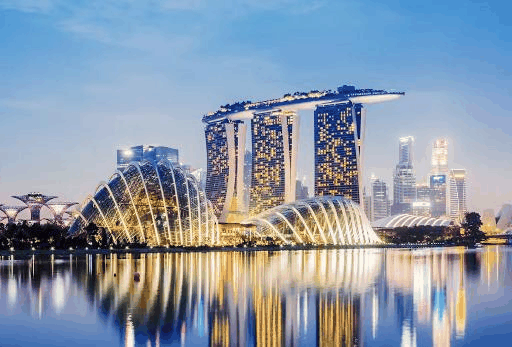
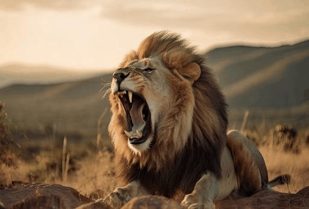

# Neural Style Transfer

This is a simple Jupyter Notebook which allows users to recombine the content and style of two arbitrary images, and capture the transition in the form of a gif. The algorithm used is based on the original paper, [A Neural Algorithm of Artistic Style](https://arxiv.org/abs/1508.06576), and references this [TensorFlow tutorial](https://www.tensorflow.org/tutorials/generative/style_transfer).

## Adjustable Parameters

The notebook allows users to customise certain parameters to generate the desired output. These parameters are as follows:

- `style_path`: path of the style image
- `content_path` : path of the content image
- `feature_maps` : Can be set to True/False. If True, the notebook will display and save sample feature maps of the convolutional layers used (refer to `style_layers` below for the specific layers used). Useful for investigating the features learned by the model when implementing the style transfer.
- `create_gif` : Can be set to True/False. If True, the notebook will display and save a gif of the style transfer process.
- `gif_fps` : Defines the frame per second (fps) of the output gif. Default set as 2.
- `plot_loss` : Can be set to True/False. If True, the notebook will plot the graph of total variational loss vs epoch/steps.
- `style_layers` and `content_layers`: The convolutional layers used to extract the style and content of the style and content images respectively. The default layers are based on the layers recommended in the original paper - `'block1_conv1'`,`'block2_conv1'`,`'block3_conv1'`,`'block4_conv1'`, and `'block5_conv1'` for the style image, and `'block5_conv2'` for the content image.
- `style_weight` and `content_weight` : Weights which can be adjusted to customise the "amount" of style/content to transfer to the final image.
- `total_variation_weight` : Can be adjusted to modify the rate of convergence of the total variation loss of the model.
- `opt` : The optimizer used to train the model. The paper recommends LBFGS, but the Adam optimizer set as the default here works just as well.

## Sample Images (1/2)

#### Content Image

#### Style Image

#### Output Gif

## Sample Images (2/2)

#### Content Image

#### Style Image

#### Output Gif

